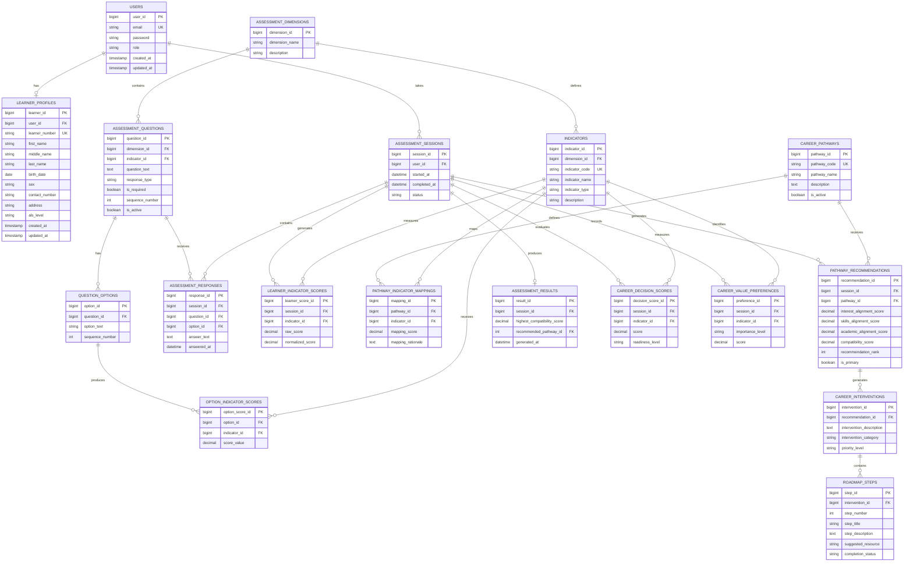

```mermaid
erDiagram

    USERS ||--o| LEARNER_PROFILES : has
    USERS ||--o{ ASSESSMENT_SESSIONS : takes

    ASSESSMENT_DIMENSIONS ||--o{ ASSESSMENT_QUESTIONS : contains
    ASSESSMENT_DIMENSIONS ||--o{ INDICATORS : defines
    ASSESSMENT_QUESTIONS ||--o{ QUESTION_OPTIONS : has
    ASSESSMENT_QUESTIONS ||--o{ ASSESSMENT_RESPONSES : receives
    ASSESSMENT_SESSIONS ||--o{ ASSESSMENT_RESPONSES : contains
    QUESTION_OPTIONS ||--o{ OPTION_INDICATOR_SCORES : produces
    INDICATORS ||--o{ OPTION_INDICATOR_SCORES : receives

    ASSESSMENT_SESSIONS ||--o{ LEARNER_INDICATOR_SCORES : generates
    INDICATORS ||--o{ LEARNER_INDICATOR_SCORES : measures

    CAREER_PATHWAYS ||--o{ PATHWAY_INDICATOR_MAPPINGS : defines
    INDICATORS ||--o{ PATHWAY_INDICATOR_MAPPINGS : maps

    ASSESSMENT_SESSIONS ||--o{ PATHWAY_RECOMMENDATIONS : generates
    CAREER_PATHWAYS ||--o{ PATHWAY_RECOMMENDATIONS : receives

    ASSESSMENT_SESSIONS ||--o| ASSESSMENT_RESULTS : produces

    ASSESSMENT_SESSIONS ||--o{ CAREER_DECISION_SCORES : evaluates
    INDICATORS ||--o{ CAREER_DECISION_SCORES : measures

    ASSESSMENT_SESSIONS ||--o{ CAREER_VALUE_PREFERENCES : records
    INDICATORS ||--o{ CAREER_VALUE_PREFERENCES : identifies

    PATHWAY_RECOMMENDATIONS ||--o{ CAREER_INTERVENTIONS : generates
    CAREER_INTERVENTIONS ||--o{ ROADMAP_STEPS : contains

    USERS {
        bigint user_id PK
        string email UK
        string password
        string role
        timestamp created_at
        timestamp updated_at
    }

    LEARNER_PROFILES {
        bigint learner_id PK
        bigint user_id FK
        string learner_number UK
        string first_name
        string middle_name
        string last_name
        date birth_date
        string sex
        string contact_number
        string address
        string als_level
        timestamp created_at
        timestamp updated_at
    }

    ASSESSMENT_DIMENSIONS {
        bigint dimension_id PK
        string dimension_name
        string description
    }

    INDICATORS {
        bigint indicator_id PK
        bigint dimension_id FK
        string indicator_code UK
        string indicator_name
        string indicator_type
        string description
    }

    ASSESSMENT_QUESTIONS {
        bigint question_id PK
        bigint dimension_id FK
        bigint indicator_id FK
        text question_text
        string response_type
        boolean is_required
        int sequence_number
        boolean is_active
    }

    QUESTION_OPTIONS {
        bigint option_id PK
        bigint question_id FK
        string option_text
        int sequence_number
    }

    ASSESSMENT_SESSIONS {
        bigint session_id PK
        bigint user_id FK
        datetime started_at
        datetime completed_at
        string status
    }

    ASSESSMENT_RESPONSES {
        bigint response_id PK
        bigint session_id FK
        bigint question_id FK
        bigint option_id FK
        text answer_text
        datetime answered_at
    }

    OPTION_INDICATOR_SCORES {
        bigint option_score_id PK
        bigint option_id FK
        bigint indicator_id FK
        decimal score_value
    }

    LEARNER_INDICATOR_SCORES {
        bigint learner_score_id PK
        bigint session_id FK
        bigint indicator_id FK
        decimal raw_score
        decimal normalized_score
    }

    CAREER_PATHWAYS {
        bigint pathway_id PK
        string pathway_code UK
        string pathway_name
        text description
        boolean is_active
    }

    PATHWAY_INDICATOR_MAPPINGS {
        bigint mapping_id PK
        bigint pathway_id FK
        bigint indicator_id FK
        decimal mapping_score
        text mapping_rationale
    }

    ASSESSMENT_RESULTS {
        bigint result_id PK
        bigint session_id FK
        decimal highest_compatibility_score
        int recommended_pathway_id FK
        datetime generated_at
    }

    PATHWAY_RECOMMENDATIONS {
        bigint recommendation_id PK
        bigint session_id FK
        bigint pathway_id FK
        decimal interest_alignment_score
        decimal skills_alignment_score
        decimal academic_alignment_score
        decimal compatibility_score
        int recommendation_rank
        boolean is_primary
    }

    CAREER_DECISION_SCORES {
        bigint decision_score_id PK
        bigint session_id FK
        bigint indicator_id FK
        decimal score
        string readiness_level
    }

    CAREER_VALUE_PREFERENCES {
        bigint preference_id PK
        bigint session_id FK
        bigint indicator_id FK
        string importance_level
        decimal score
    }

    CAREER_INTERVENTIONS {
        bigint intervention_id PK
        bigint recommendation_id FK
        text intervention_description
        string intervention_category
        string priority_level
    }

    ROADMAP_STEPS {
        bigint step_id PK
        bigint intervention_id FK
        int step_number
        string step_title
        text step_description
        string suggested_resource
        string completion_status
    }
```